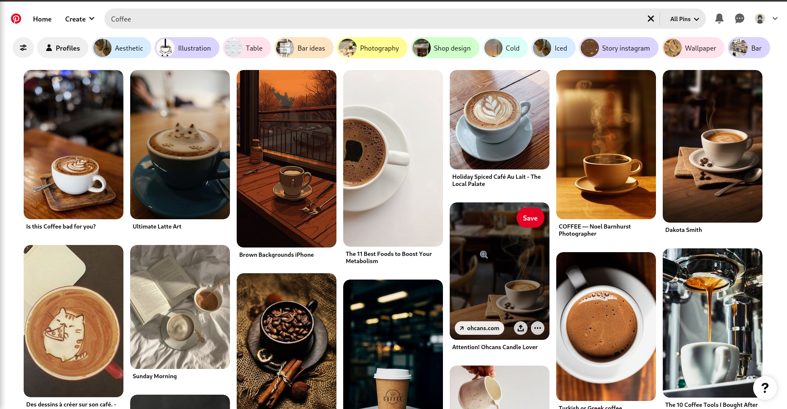

## **Pinterest Image Download by Keywords**
You can download as many images as you want about the searched words.


[](https://www.pinterest.com/search/pins/?q=Coffee)

## How to Run

```php
// checking the exists Library.
if (!file_exists('pinterest.php')) {
  copy('https://raw.githubusercontent.com/hctilg/pinterest-crawler/main/pinterest.php', 'pinterest.php');
}

// require Library.
require_once __DIR__ . '/pinterest.php';

// Usage
$configs = new PinterestConfig("Coffee", 200, "orig", '');
$scraper = new PinterestScraper($configs);

$scraper->downloadImages();   // download images directly
print_r($scraper->getUrls()); // just bring image links
```
